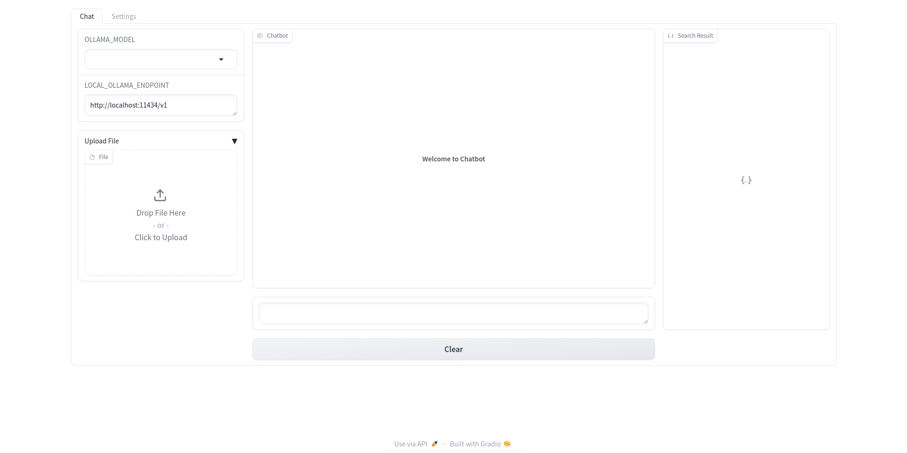

# Chatbot Web UI

This project features a web-based chatbot interface built using [Gradio library](https://gradio.app/) and model from the [Hugging Face Transformers library](https://huggingface.co/transformers/). The interface allows users to interact with an AI model, customize text generation parameters, and engage in dynamic conversations.



## Getting Started

1. Clone this repository:

```bash
git clone https://github.com/QinWenFeng/chatbot-web-ui.git
cd chatbot-web-ui
```

2. Install the required dependencies:

```bash
pip install -r requirements.txt
```

## Usage

1. Run the following command to start the chatbot interface:

```bash
python main.py
```

2. Once the server is running, open your web browser and navigate to http://127.0.0.1:7860 to access the chatbot interface.


